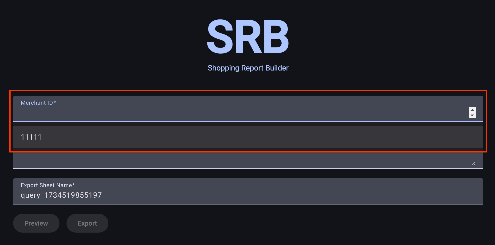

# Shopping Report Builder

This tool simplifies the process of extracting reports from [the Reporting API
in Google Merchant Center](
    https://developers.google.com/shopping-content/guides/reports/overview) for
users who are less familiar with coding.

## The Problem
The Google Merchant Center UI doesn't allow exporting all available fields. This
can be a hurdle for users who need specific data for tasks like optimization,
but lack the technical expertise to access it via the Reporting API directly.

## Solution
This project offers a user-friendly interface embedded within Google Sheets.
Users can construct custom queries based on the Content API to extract specific
data from Merchant Center. The extracted information is then populated directly
into the Google Sheet, ready for analysis and further reporting.


## Getting Started
The easiest method for most users is to:

1. Create a copy of [this Google Sheet](
   https://docs.google.com/spreadsheets/d/1rPTfluBVhydjXS8BSnI8xHtk3ilzaBA_VnRMw3Y40HY/edit).
2. Go to `Extensions` -> `Apps Script`.

3. Deploy the UI:
   1. Press `Deploy` -> `New Deployment`
      
   2. Press `Deploy` in the pop up:
      
   3. Copy and save the URL from the window: this is where you view the UI:
      
4. Open the deployment URL for the UI. The first time you do this you'll see a
   pop up about permissions. You need to press the `review permissions` button,
   and approve the app access.
   
   Note about Permissions: You might see a warning that this app isn't verified
   by Google. This is because the script uses Google's built-in, default project configuration to make it easy for anyone to use without needing to set up
   their own, more complex, Google Cloud project. The script only accesses your
   Google Sheet and Merchant Center data to generate reports as you request it,
   and the code is open for you to review.
   To proceed, press `Show Advanced` and `Go to Shopping Report Builder | Prod`.
   
   After passing the permission warnings, you should now see the UI, and be able
   to run reports. See [example queries](#example-queries) for some inspiration
   to get started.

### Optional Config

#### Merchant ID Autocomplete
The UI has an autocomplete on the merchant ID field to save you having to
remember your IDs. These values are pulled from Column A of the "Config" sheet.
You do not need to select one of these options in the UI, so this is optional.

The description column is to provide some helpful notes if you have a few
accounts.




## Advanced Users

### Manual Deployment (For users comfortable with Node.js and clasp)

These instructions guide you through a manual deployment process using the clasp
tool:

1. **Install Node.js and npm**: Ensure you have an up-to-date installation of
   Node.js and npm ([guide](
    https://docs.npmjs.com/downloading-and-installing-node-js-and-npm)).
2. **Install clasp**: Install clasp globally by running:
   `npm install @google/clasp -g.`
3. **Login with clasp**: Log in to clasp using `clasp login`.
4. **Enable Apps Script API**: Navigate to [the Apps Script Settings page](
   https://script.google.com/corp/home/usersettings) and enable the Apps Script
   API.
5. **Get App Script ID**: Create a new Google Sheet. Go to Extensions -> App
   Script -> Project settings and copy the project ID.
6. **Configure clasp**:
  - Run `cp example.clasp.json .clasp.json` (copies a configuration file).
  - Update the `scriptId` property in the `.clasp.json` file with the App Script
    ID you copied in step 5.
7. Deploy the script: Run `./deploy.sh` to deploy the script to your Google Apps
   Script project.


### Local Development (For developers who want to contribute)

For developers interested in contributing to the UI development, standard
Angular commands can be used:

`ng serve`: Starts the development server.

Mock data is returned in development, it does not query the API. If you enter a
merchant ID of 1, it will return a mock error.

## Project Structure
The project is organized as follows:

- `/backend`: Contains all the Google Apps Script code responsible for
  interacting with the Reporting API and populating the Sheet.
- `/ui`: Contains the Angular code for the user interface.

The subdirectories are configured to build the production code in a shared
`/dist` folder in the parent directory. Clasp then pushes all these files to
Apps Script.

## Example Queries

Here's a sample you can use to view click potential for your products and help
you prioritize your efforts:
```
SELECT
  product_view.id,
  product_view.offer_id,
  product_view.aggregated_destination_status,
  product_view.click_potential,
  product_view.click_potential_rank
FROM
  ProductView
ORDER BY
  product_view.click_potential_rank
```

Here's a sample you can use to view best-selling products:
```
SELECT
  best_sellers.report_date,
  best_sellers.report_granularity,
  best_sellers.country_code,
  best_sellers.category_id,
  best_sellers.rank,
  best_sellers.previous_rank,
  best_sellers.relative_demand,
  best_sellers.previous_relative_demand,
  best_sellers.relative_demand_change,
  product_cluster.title,
  product_cluster.brand,
  product_cluster.category_l1,
  product_cluster.category_l2,
  product_cluster.category_l3,
  product_cluster.variant_gtins,
  product_cluster.inventory_status,
  product_cluster.brand_inventory_status
FROM
  BestSellersProductClusterView
WHERE
  best_sellers.report_date = '2024-12-02'
  AND best_sellers.report_granularity = 'WEEKLY'
  AND best_sellers.country_code = 'GB'
  AND best_sellers.category_id = 166
ORDER BY
  best_sellers.rank
```

Here's a sample you can use to view price competitiveness data, remembering that
prices are in micros. This means you'll have to divide the prices by 1,000,000:
```
SELECT
  product_view.id,
  product_view.title,
  product_view.brand,
  product_view.price_micros,
  product_view.currency_code,
  price_competitiveness.country_code,
  price_competitiveness.benchmark_price_micros,
  price_competitiveness.benchmark_price_currency_code
FROM
  PriceCompetitivenessProductView
```

Here's a sample you can use to view suggested sales prices for your products:
```
SELECT
  product_view.id,
  product_view.title,
  product_view.brand,
  product_view.price_micros,
  product_view.currency_code,
  price_insights.suggested_price_micros,
  price_insights.suggested_price_currency_code,
  price_insights.predicted_impressions_change_fraction,
  price_insights.predicted_clicks_change_fraction,
  price_insights.predicted_conversions_change_fraction
FROM
  PriceInsightsProductView
```

Here's a sample you can use to view topic popularity and trend data:
```
SELECT
  topic_trends.customer_country_code,
  topic_trends.topic,
  topic_trends.date,
  topic_trends.search_interest,
  topic_trends.last7_days_search_interest,
  topic_trends.last30_days_search_interest,
  topic_trends.last90_days_search_interest,
  topic_trends.last120_days_search_interest,
  topic_trends.next7_days_search_interest
FROM
  TopicTrendsView
WHERE
  topic_trends.customer_country_code = 'GB'
  AND topic_trends.date BETWEEN '2024-12-01' AND '2024-12-03'
ORDER BY
  topic_trends.date DESC
```

## Disclaimer
__This is not an officially supported Google product.__

Copyright 2024 Google LLC. This solution, including any related sample code or
data, is made available on an "as is", "as available", and "with all faults"
basis, solely for illustrative purposes, and without warranty or representation
of any kind. This solution is experimental, unsupported and provided solely for
your convenience. Your use of it is subject to your agreements with Google, as
applicable, and may constitute a beta feature as defined under those agreements.
To the extent that you make any data available to Google in connection with your
use of the solution, you represent and warrant that you have all necessary and
appropriate rights, consents and permissions to permit Google to use and process
that data. By using any portion of this solution, you acknowledge, assume and
accept all risks, known and unknown, associated with its usage, including with
respect to your deployment of any portion of this solution in your systems, or
usage in connection with your business, if at all.
